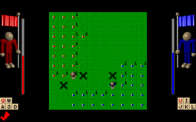

# Xarman - a simple SDL game for Linux.

Xarman is an addictive micro-game, a two player cross between Minesweeper and Dyna Blaster.

  

## Contents

<!-- toc -->

* [Contents](#contents)
* [Credits](#credits)
* [Story](#story)
* [The game and controls](#the-game-and-controls)
* [License](#license)
* [Requirements](#requirements)
* [Building Xarman](#building-xarman)
  * [Bootstrapping (only relevant when building from github source)](#bootstrapping-only-relevant-when-building-from-github-source)
  * [Configuration](#configuration)
  * [Compiling](#compiling)
  * [Installing](#installing)
* [Running Xarman](#running-xarman)
* [Bugs](#bugs)

<!-- toc stop -->

## Credits

Xarman was made by the members of ECC, with Xar as the coder, and
Firimar as the artist.

It was ported to Linux (svgalib) in June 1999, by Mads Bondo
Dydensborg <mads@dydensborg.dk>. Sound module under Linux by Mads
Bondo Dydensborg.

It was ported to SDL in February 2002, by Mads Bondo Dydensborg.

## Story

The Great War (World War IV) destroyed all life on planet Earth. Two
revival clans got away in large space stations. Now 50 years after,
both clans want to reconquer the Earth. But the ground is covered with
mines. The clans send specially designed cyborgs to conquer
terrain. These cyborgs are equipped with a mine scanner. They always
know how many mines there are in a short radius. And they can find the
mines, but that takes time. The red and the blue team fights to get
the land first. Only one clan can move back to Earth.

## The game and controls

The game is a 2 player cross between Minesweeper and Dyna Blaster. Red
player is controlled by ASDW and Q, and blue player is controlled by
JKLI and U. You are placed in one corner of the screen, and you have
to walk around conquering land. The numbers are the amount of mines in
a radius of 1 square from the point. You can use Q or U to scan for
where the mines are, but this takes time. You win by marking half the
squares with your flag, you can not take the other players
squares. You die if you step on a mine. Race against a friend.  

During play, you can press F11 to toggle fullscreen mode.

## License

Xarman is released under the GPL.

Copyright (C) 1999-2002 Mads Bondo Dydensborg <mads@dydensborg.dk>
(Parts may be (C) ECC)

Please see the file "AUTHORS" for a list of contributers
 
This program is free software; you can redistribute it and/or modify
it under the terms of the GNU General Public License as published by
the Free Software Foundation; either version 2 of the License, or
(at your option) any later version.
 
This program is distributed in the hope that it will be useful,
but WITHOUT ANY WARRANTY; without even the implied warranty of
MERCHANTABILITY or FITNESS FOR A PARTICULAR PURPOSE.  See the
GNU General Public License for more details.
 
You should have received a copy of the GNU General Public License
along with this program; if not, write to the Free Software
Foundation, Inc., 59 Temple Place, Suite 330, Boston, MA  02111-1307  USA   

## Requirements

SDL, SDL_mixer, SDL_image

Xarman have only been tested on Linux, using version 1.2.2 of SDL and
1.2.0 of SDL_mixer and SDL_image with X as the target.

## Building Xarman

Xarman uses the GNU autotools, and configuration and installation
should be quite straightforward.

### Bootstrapping (only relevant when building from github source)

If you have checked out the sources from github, you should run the shell
script `bootstrap`, which will create the script `configure` for you.

### Configuration

If you have downloaded a tar ball, the configure script should already
be in place. Run `./configure --help` to get an overview of the options.

The file `INSTALL` provides generic installation instructions for the
configure script.

If configure fails, it is most likely because you are missing needed
libraries. The configure script will try to identify all missing
libraries when run, and will let you know what is missing.

### Compiling

After a successful configuration step, you can compile xarman like
this:

`$ make`

If the installation fails and it is during the linking stage, it is
most likely because you have discovered a dependency on a library,
that the configure script does not take into account. A likely cause
is that you need a `devel` package for some library on your Linux
system. Please install the necessary package and `make` again.

### Installing

You do not need to install xarman to test it out. But if you wish, you
can issue the command

`$ make install`

to install xarman to the location you configured for (default
`/usr/local/`). Xarman does not follow the LSB directions of installing
games to `/usr/local/games/bin/xarman`, but instead installs to
`/usr/local/bin/xarman`. Shared files are installed into
`/usr/local/share/games/xarman` however. 

## Running Xarman

After building xarman, you can either issue the command

`$ src/xarman`

or, if you have installed xarman

`$/path/to/xarman`

to run xarman.

For mostly selfexplaining options run xarman with the `--help` option.

## Bugs

No know bugs.

